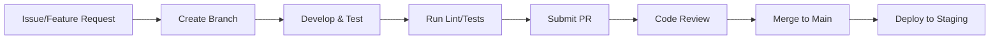

# 🏨 Hotel Management System (HMS) - Full Stack

<div align="center">


**A comprehensive, modern hotel management solution with elegant React frontend and robust Spring Boot backend.**

[](https://magdumom-ml-5959315.postman.co/workspace/6e8884c4-ed53-4c75-b0c1-d3e1d79b9d11)

</div>

---

## 📋 Table of Contents

- [Overview](#-overview)
- [✨ Features](#-features)
- [🛠️ Tech Stack](#-tech-stack)
- [🏗️ Architecture](#-architecture)
- [🚀 Getting Started](#-getting-started)
- [⚙️ Configuration](#-configuration)
- [🔐 Authentication & Roles](#-authentication--roles)
- [📚 API Documentation](#-api-documentation)
- [🗄️ Database Schema](#-database-schema)
- [🧪 Testing](#-testing)
- [🚢 Deployment](#-deployment)
- [📁 Project Structure](#-project-structure)
- [🤝 Contributing](#-contributing)
- [📄 License](#-license)

---

## 🌟 Overview

Hotel Management System (HMS) is a full-stack application designed to streamline hotel operations. It provides a modern, intuitive interface for staff to manage bookings, rooms, customers, and reporting, powered by a secure, scalable REST API backend.

### Repository Structure

```
hotel-management-system/
├── backend/           # Spring Boot REST API (this repo)
├── frontend/          # React + TypeScript SPA (companion repo)
├── docker-compose.yml # Full-stack container orchestration
└── docs/              # Documentation & assets
```

> 💡 **Note:** This README covers the complete system. For backend-only details, see [`backend/README.md`](https://github.com/ommagdum/hms/blob/main/README.md). For frontend-only details, see [`frontend/README.md`](https://github.com/ommagdum/hms-frontend/blob/main/README.md).

---

## ✨ Features

### 🎯 Core Functionality

| Module | Features |
|--------|----------|
| **🔐 Authentication** | JWT-based auth, role-based access (ADMIN, MANAGER, RECEPTIONIST) |
| **📊 Dashboard** | Real-time occupancy, revenue metrics, booking trends, recent activity |
| **📅 Bookings** | Create, update, cancel with conflict detection & date validation |
| **🛏️ Rooms** | CRUD operations, availability checking, status management |
| **👥 Customers** | Guest profiles, duplicate validation, booking history |
| **👨‍💼 Staff** | Employee management with role assignment (Admin only) |
| **📄 Invoicing** | PDF generation, email delivery with attachments |
| **📈 Reports** | Daily revenue, monthly occupancy, customer history (PDF/Excel) |

### 🎨 User Experience

- ✨ Modern UI with hotel-themed design (forest green & gold palette)
- 📱 Fully responsive for desktop & tablet
- 🗓️ Interactive calendar for room availability
- ⚡ Real-time status updates & notifications
- 📊 Beautiful charts with Recharts for data visualization

### 🔧 Technical Highlights

- ✅ **Concurrency Control** - Pessimistic locking prevents double bookings
- ✅ **Validation** - Comprehensive input validation at API & UI boundaries
- ✅ **Error Handling** - Centralized exception handling with consistent responses
- ✅ **Async Processing** - Non-blocking email sending for invoices
- ✅ **Multi-Environment** - Separate configs for dev, test, production
- ✅ **Containerized** - Docker & Docker Compose for easy deployment
- ✅ **Test Coverage** - 85% code coverage with unit & integration tests

---

## 🛠️ Tech Stack

### Frontend (`/frontend`)

| Category | Technology |
|----------|------------|
| **Framework** | React 19.2.0 + TypeScript 5.9.3 |
| **Build Tool** | Vite 7.3.1 |
| **Styling** | Tailwind CSS 3.4.19 |
| **Icons** | Lucide React 0.575.0 |
| **Charts** | Recharts 3.7.0 |
| **Routing** | React Router DOM 7.13.1 |
| **State** | Context API + Custom Hooks |
| **HTTP** | Axios 1.13.5 with JWT interceptors |
| **Utilities** | date-fns 4.1.0, jwt-decode 4.0.0 |

### Backend (`/backend`)

| Category | Technology |
|----------|------------|
| **Language** | Java 17+ |
| **Framework** | Spring Boot 3.5.10 |
| **Security** | Spring Security + JWT (jjwt) |
| **Database** | MySQL 8.0 / H2 (testing) |
| **ORM** | Spring Data JPA + Hibernate |
| **Build** | Maven |
| **Containerization** | Docker, Docker Compose |
| **Reporting** | Apache POI (Excel), OpenPDF/iText (PDF) |
| **Email** | Spring Boot Mail (SMTP) |
| **Testing** | JUnit 5, Mockito, AssertJ, JaCoCo |
| **Utilities** | Lombok, ModelMapper |

### DevOps & Infrastructure

| Tool | Purpose |
|------|---------|
| **Docker** | Containerized application & database |
| **Docker Compose** | Local development orchestration |
| **JaCoCo** | Code coverage reporting |
| **Maven** | Dependency management & build |

---

## 🏗️ Architecture

```
┌─────────────────────────────────────────────────────────────────┐
│                    Frontend (React + TypeScript)                 │
│  ┌─────────────────────────────────────────────────────────┐   │
│  │  • React Components & Pages                             │   │
│  │  • Tailwind CSS Styling                                 │   │
│  │  • Axios HTTP Client with JWT Interceptor               │   │
│  │  • React Router for Navigation                          │   │
│  │  • Context API for Auth State                           │   │
│  └─────────────────────────────────────────────────────────┘   │
└─────────────────────────────────────────────────────────────────┘
                              │
                              │ HTTP/HTTPS (JSON)
                              │ Authorization: Bearer <JWT>
                              ▼
┌─────────────────────────────────────────────────────────────────┐
│                    Backend (Spring Boot)                         │
│  ┌─────────────────────────────────────────────────────────┐   │
│  │  • REST Controllers (@RestController)                   │   │
│  │  • JWT Filter & Spring Security                         │   │
│  │  • Service Layer (Business Logic)                       │   │
│  │  • JPA Repositories (Data Access)                       │   │
│  │  • DTOs & Validation (@Valid)                           │   │
│  └─────────────────────────────────────────────────────────┘   │
└─────────────────────────────────────────────────────────────────┘
                              │
                              ▼
┌─────────────────────────────────────────────────────────────────┐
│                    MySQL Database (Port 3306)                    │
│  Tables: bookings, customers, rooms, staff                       │
└─────────────────────────────────────────────────────────────────┘
```

### Key Design Patterns

- **Layered Architecture** - Clear separation: Controller → Service → Repository
- **DTO Pattern** - Decouples API contract from domain entities
- **Repository Pattern** - Abstracts data access logic
- **Factory Methods** - Consistent API response wrapping (`ApiResponse<T>`)
- **Async Processing** - `@Async` for non-blocking email delivery

---

## 🚀 Getting Started

### Prerequisites

| Requirement | Version | Notes |
|-------------|---------|-------|
| **Node.js** | 18+ | For frontend development |
| **Java** | 17+ | For backend development |
| **Maven** | 3.6+ | Backend build tool |
| **Docker** | 20.10+ | Recommended for full setup |
| **Docker Compose** | 2.0+ | Multi-container orchestration |
| **MySQL** | 8.0+ | Only if not using Docker |

---

### Option 1: Full Stack with Docker Compose (Recommended) 🐳

```bash
# Clone the monorepo
git clone <repository-url>
cd hotel-management-system

# Copy environment template
cp .env.example .env
# Edit .env with your values (see Configuration section)

# Start all services (frontend, backend, MySQL)
docker-compose up -d

# View logs
docker-compose logs -f

# Stop services
docker-compose down
```

> ✅ **Benefits:** One-command setup, consistent environments, no local Java/Node installation required.

---

### Option 2: Local Development (Backend + Frontend Separately)

#### 🔹 Backend Setup

```bash
cd backend

# Set environment variables
export MYSQL_PASSWORD=your_password
export MAIL_ID=your_email@example.com
export MAIL_PASSWORD=your_app_password
export JWT_SECRET=your_secret_key_at_least_32_characters_long

# Run with Maven
mvn spring-boot:run

# Or build & run JAR
mvn clean package
java -jar target/hms-0.0.1-SNAPSHOT.jar
```

Backend will be available at: `http://localhost:8080`

#### 🔹 Frontend Setup

```bash
cd frontend

# Install dependencies
npm install

# Start development server
npm run dev
```

Frontend will be available at: `http://localhost:5173`

> 💡 Ensure backend is running on `http://localhost:8080` before starting frontend.

---

### 🔑 Default Admin Credentials

On first startup, a default admin user is created:

| Username | Password | Role |
|----------|----------|------|
| `admin` | `admin123` | ADMIN |

> ⚠️ **Critical:** Change the default password immediately in production!

---

## ⚙️ Configuration

### Environment Variables (`.env`)

```bash
# ===== Database =====
MYSQL_PASSWORD=your_secure_password

# ===== Email (SMTP for invoices) =====
MAIL_ID=your_email@example.com
MAIL_PASSWORD=your_app_specific_password

# ===== Security =====
JWT_SECRET=your_secret_key_minimum_32_characters_long

# ===== CORS & Frontend =====
FRONTEND_URLS=https://your-frontend-domain.com,http://localhost:5173

# ===== Production Database (optional override) =====
SPRING_DATASOURCE_URL=jdbc:mysql://your-host:3306/hotel_management
```

### Application Profiles

| Profile | File | Purpose |
|---------|------|---------|
| `default` | `application.yaml` | Development (ddl-auto=update, verbose logging) |
| `prod` | `application-prod.yaml` | Production (ddl-auto=validate, connection pooling, restricted CORS) |
| `test` | `application-test.yaml` | Testing (H2 in-memory database) |

### Frontend API Configuration

Configure API base URL in `frontend/src/api/client.ts`:

```typescript
// Development
const API_BASE_URL = 'http://localhost:8080/api';

// Production (use environment variable)
// const API_BASE_URL = import.meta.env.VITE_API_BASE_URL;
```

Create `.env.production` for production builds:

```bash
VITE_API_BASE_URL=https://your-api-domain.com/api
```

---

## 🔐 Authentication & Roles

### JWT Authentication Flow

```
1. User enters credentials → Frontend sends POST /api/auth/login
2. Backend validates → Returns JWT token + user details
3. Frontend stores token (localStorage/Context)
4. All subsequent requests include: Authorization: Bearer <token>
5. Backend JWT filter validates token & sets authentication context
```

### Role-Based Access Control

| Role | Permissions |
|------|-------------|
| **👑 ADMIN** | Full system access: all endpoints + staff management |
| **👔 MANAGER** | Dashboard, Reports, Bookings, Customers, Rooms, Invoices |
| **🔑 RECEPTIONIST** | Bookings, Customers, Rooms, Calendar, Invoices |

### Protected Routes (Frontend)

```typescript
// Example: ProtectedRoute component
<Route 
  path="/dashboard" 
  element={
    <ProtectedRoute allowedRoles={['ADMIN', 'MANAGER']}>
      <Dashboard />
    </ProtectedRoute>
  } 
/>
```

All routes except `/login` require authentication. Unauthorized access redirects to login.

---

## 📚 API Documentation

### Base URL
```
http://localhost:8080/api
```

### 📦 Postman Collection
Import the collection to test all endpoints interactively:

[](https://magdumom-ml-5959315.postman.co/workspace/6e8884c4-ed53-4c75-b0c1-d3e1d79b9d11)

### 🔗 Key Endpoints Overview

| Module | Endpoint | Methods | Access |
|--------|----------|---------|--------|
| **Auth** | `/api/auth/login` | POST | Public |
| **Bookings** | `/api/bookings/**` | GET, POST, PUT | ADMIN, MANAGER, RECEPTIONIST |
| **Customers** | `/api/customers/**` | GET, POST, PUT, DELETE | ADMIN, MANAGER, RECEPTIONIST |
| **Rooms** | `/api/rooms/**` | GET, POST, PUT, DELETE | ADMIN, RECEPTIONIST |
| **Rooms (Public)** | `/api/rooms/available` | GET | Public |
| **Staff** | `/api/staff/**` | GET, POST, PUT, DELETE | ADMIN only |
| **Dashboard** | `/api/dashboard/summary` | GET | ADMIN, MANAGER |
| **Invoice** | `/api/invoice/{id}` | GET (PDF), POST (email) | ADMIN, MANAGER, RECEPTIONIST |
| **Reports** | `/api/reports/**` | GET, Export (PDF/Excel) | ADMIN, MANAGER |

### 📤 Response Format

**Success Response:**
```json
{
  "success": true,
  "message": "Operation completed successfully",
  "data": { ... }
}
```

**Error Response:**
```json
{
  "timestamp": "2026-03-04T10:30:00",
  "message": "Resource not found",
  "details": "/api/bookings/999",
  "status": 404
}
```

**Validation Errors:**
```json
{
  "success": false,
  "message": "Validation failed",
  "data": {
    "email": "must be a valid email address",
    "phone": "must be 10-15 digits"
  }
}
```

---

## 🗄️ Database Schema

### Entity Relationship Diagram

```
┌──────────────┐       ┌──────────────┐       ┌──────────────┐
│   Customer   │       │   Booking    │       │     Room     │
├──────────────┤       ├──────────────┤       ├──────────────┤
│ customerId   │◄──────│ customerId   │       │ roomId       │
│ name         │       │ roomId       │──────►│ roomNumber   │
│ email*       │       │ checkIn      │       │ roomType     │
│ phone*       │       │ checkOut     │       │ price        │
│ address      │       │ totalAmount  │       │ status       │
│ timestamps   │       │ status       │       │ timestamps   │
└──────────────┘       │ timestamps   │       └──────────────┘
                       └──────────────┘

┌──────────────┐
│     Staff    │
├──────────────┤
│ staffId      │
│ username*    │
│ password*    │ (BCrypt hashed)
│ name         │
│ role*        │ (ADMIN/MANAGER/RECEPTIONIST)
│ contact      │
│ salary       │
│ enabled      │
│ timestamps   │
└──────────────┘
```
> `*` = Unique or required field

### Tables Summary

| Table | Description |
|-------|-------------|
| `customers` | Guest information with unique email/phone constraints |
| `rooms` | Hotel rooms with type, price, and operational status |
| `bookings` | Reservations linking customers to rooms with date ranges |
| `staff` | System users with roles, credentials, and access control |

---

## 🧪 Testing

### Backend Tests

```bash
cd backend

# Run all tests with coverage
mvn clean verify

# View HTML coverage report
open target/site/jacoco/index.html
```

**Coverage Summary:**
| Layer | Coverage |
|-------|----------|
| **Overall** | 85% |
| **Service Layer** | 86% |
| **Security/JWT** | 95% |
| **Controller Layer** | 76% |
| **Configuration** | 100% |

### Frontend Tests

```bash
cd frontend

# Run tests (if configured)
npm test

# Run linting
npm run lint
```

### Test Types

| Type | Location | Description |
|------|----------|-------------|
| **Unit Tests** | `backend/src/test/java/**/service/` | Mocked repository tests |
| **Integration Tests** | `backend/src/test/java/**/integration/` | Full HTTP tests with H2 |
| **Security Tests** | `backend/src/test/java/**/security/` | JWT & auth flow tests |
| **E2E (Planned)** | `frontend/cypress/` | End-to-end UI tests |

---

## 🚢 Deployment

### Docker Deployment (Recommended)

```bash
# Build and start full stack
docker-compose -f docker-compose.yml up -d --build

# View logs
docker-compose logs -f app frontend

# Stop
docker-compose down
```

### Production Checklist ✅

- [ ] Set strong `JWT_SECRET` (minimum 32 characters, use generator)
- [ ] Configure `FRONTEND_URLS` with your production domain(s)
- [ ] Use production MySQL instance (not Docker dev volume)
- [ ] Set `SPRING_PROFILES_ACTIVE=prod`
- [ ] Change default admin password immediately
- [ ] Configure SSL/TLS termination (reverse proxy recommended)
- [ ] Set up monitoring (logs, metrics, alerts)
- [ ] Enable HTTPS for frontend (Vite build + nginx/Apache)
- [ ] Rotate database credentials & use secrets management

### Live Demo

> 🚧 **Coming Soon** - A live deployment will be available at:
> ```
> Frontend: https://app.hms-demo.com
> Backend API: https://api.hms-demo.com
> ```

---

## 📁 Project Structure

### Root Level
```
hotel-management-system/
├── backend/                 # Spring Boot API
│   ├── src/main/java/com/vinayakit/hms/
│   │   ├── config/          # Security, CORS, Beans
│   │   ├── controller/      # REST API endpoints
│   │   ├── dto/             # Data Transfer Objects
│   │   ├── entity/          # JPA Entities
│   │   ├── exception/       # Custom exceptions & handler
│   │   ├── repository/      # Spring Data JPA repos
│   │   ├── security/        # JWT, UserDetailsService, Filter
│   │   ├── service/         # Business logic
│   │   └── HmsApplication.java
│   ├── src/main/resources/
│   │   ├── application.yaml
│   │   ├── application-prod.yaml
│   │   └── application-test.yaml
│   ├── src/test/            # Unit & integration tests
│   ├── Dockerfile
│   ├── pom.xml
│   └── README.md
│
├── frontend/                # React + TypeScript SPA
│   ├── src/
│   │   ├── api/             # Axios services & interceptors
│   │   ├── components/      # Reusable UI components
│   │   ├── contexts/        # React Context (Auth)
│   │   ├── layouts/         # App layout wrappers
│   │   ├── pages/           # Route components
│   │   │   ├── Dashboard.tsx
│   │   │   ├── Bookings.tsx
│   │   │   ├── Rooms.tsx
│   │   │   ├── Customers.tsx
│   │   │   ├── Staff.tsx
│   │   │   └── Reports/
│   │   └── utils/           # Helpers & auth utilities
│   ├── public/
│   ├── index.html
│   ├── vite.config.ts
│   ├── package.json
│   ├── tailwind.config.js
│   └── README.md
│
├── docker-compose.yml       # Full-stack orchestration
├── .env.example             # Environment template
├── .gitignore
└── README.md                # This file
```

---

## 🤝 Contributing

We welcome contributions! Please follow these steps:

1. **Fork** the repository
2. **Create** a feature branch:
   ```bash
   git checkout -b feature/amazing-feature
   ```
3. **Commit** your changes with clear messages:
   ```bash
   git commit -m 'feat: add amazing feature'
   ```
4. **Push** to your branch:
   ```bash
   git push origin feature/amazing-feature
   ```
5. **Open** a Pull Request with description & screenshots if UI changes

### Guidelines

✅ **Do:**
- Follow existing code style (ESLint for frontend, Checkstyle for backend)
- Write tests for new features & bug fixes
- Update documentation (this README, API docs, comments)
- Use TypeScript strictly in frontend
- Keep commits atomic and well-described

❌ **Don't:**
- Commit secrets or `.env` files
- Break existing tests
- Submit large PRs without discussion (open an issue first)
- Modify production configs without review

### Development Workflow



---

## 📄 License

This project is licensed under the **MIT License** - see the [LICENSE](LICENSE) file for details.

```
MIT License

Copyright (c) 2026 Hotel Management System

Permission is hereby granted, free of charge, to any person obtaining a copy
of this software and associated documentation files (the "Software"), to deal
in the Software without restriction, including without limitation the rights
to use, copy, modify, merge, publish, distribute, sublicense, and/or sell
copies of the Software, and to permit persons to whom the Software is
furnished to do so, subject to the following conditions:

The above copyright notice and this permission notice shall be included in all
copies or substantial portions of the Software.

THE SOFTWARE IS PROVIDED "AS IS", WITHOUT WARRANTY OF ANY KIND, EXPRESS OR
IMPLIED, INCLUDING BUT NOT LIMITED TO THE WARRANTIES OF MERCHANTABILITY,
FITNESS FOR A PARTICULAR PURPOSE AND NONINFRINGEMENT.
```

---

## 📞 Support & Contact

For issues, questions, or contributions:

| Channel | Link |
|---------|------|
| 🐛 **Bug Reports** | [Create an Issue](../../issues) |
| 💡 **Feature Requests** | [Create an Issue](../../issues) |
| 💬 **Discussions** | [GitHub Discussions](../../discussions) |
| 📧 **Email** | [your-email@example.com] |

### Quick Help

```bash
# Backend: Run tests
cd backend && mvn test

# Frontend: Lint code
cd frontend && npm run lint

# Full stack: Restart with Docker
docker-compose down && docker-compose up -d --build
```

---

<div align="center">

**Made with ❤️ using React, TypeScript, Spring Boot & Java**

⭐ **Star this repository if you find it helpful!**

[]([frontend/README.md](https://github.com/ommagdum/hms-frontend/blob/main/README.md))
[]([backend/README.md](https://github.com/ommagdum/hms/blob/main/README.md))

</div>
```
